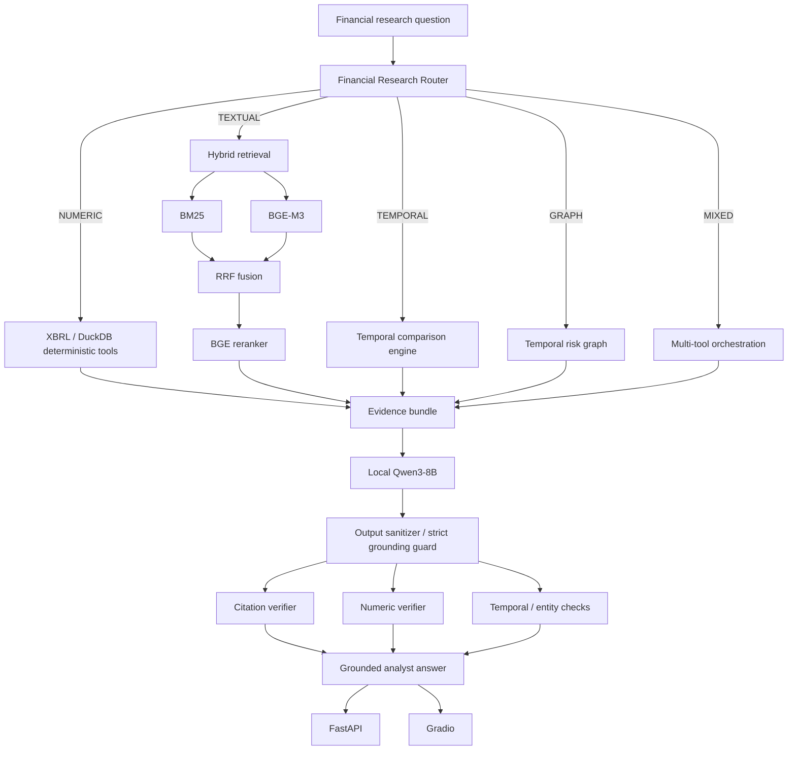

# FilingsGraph — Temporal Financial Due-Diligence & Risk Intelligence Engine

[](https://www.python.org/)
[](https://huggingface.co/Qwen)
[](https://huggingface.co/BAAI/bge-m3)
[](#agentic-financial-research)
[](#temporal-knowledge-graph)
[](https://www.sec.gov/edgar)
[](https://fastapi.tiangolo.com/)
[](https://www.gradio.app/)
[](https://github.com/unit-mole/filingsgraph-agentic-rag/actions)
[](https://github.com/unit-mole/filingsgraph-agentic-rag/actions)
[](https://github.com/unit-mole/filingsgraph-agentic-rag/actions)
[](LICENSE)

A portfolio-grade **Agentic RAG system for financial due diligence and risk intelligence** that combines SEC EDGAR filings, XBRL facts, hybrid retrieval, deterministic financial tools, temporal disclosure comparison, a provenance-preserving risk graph, local Qwen3 reasoning, and claim-level citation verification.

**Status:** Final local evaluation completed; FastAPI and Gradio validated; GitHub release in progress  
**Repository:** [unit-mole/filingsgraph-agentic-rag](https://github.com/unit-mole/filingsgraph-agentic-rag)  
**Live application:** Hugging Face deployment will be added after the public Space is validated  
**Primary stack:** Python · Qwen3-8B · BGE-M3 · BGE reranker · BM25 · Reciprocal Rank Fusion · Qdrant · DuckDB · NetworkX · SEC EDGAR/XBRL · FastAPI · Gradio · pytest · Ruff

> **Mandatory paid external LLM/API dependency: $0.**  
> The validated reasoning path uses locally executed open-source models. Hardware, electricity, storage, and internet access are not claimed to be free.

---

## Responsible Use

FilingsGraph is a research, engineering, and portfolio project. It is not investment, legal, accounting, or trading advice.

- Source material is restricted to publicly available filing and financial information.
- Filing text is treated as **untrusted executable input**: instructions embedded inside filings are never followed as agent commands.
- SEC/XBRL evidence is still treated as legitimate research evidence when cited and verified.
- Deterministic financial calculations are preferred over free-form model arithmetic.
- Generated synthesis is evidence-grounded and citation-checked.
- Human review remains appropriate for high-stakes financial conclusions.

---

## Business Problem

Public-company due diligence is rarely a single retrieval problem.

An analyst may need to answer questions such as:

> “How did NVIDIA revenue change while its export-control risk disclosure evolved across fiscal years?”

That requires multiple forms of reasoning at once:

- identify the correct company and filing period,
- retrieve narrative filing evidence,
- resolve exact XBRL financial facts,
- distinguish old versus new risk language,
- identify common risk exposure across companies,
- preserve filing/section provenance,
- calculate changes deterministically,
- and ensure every material claim is supported by evidence.

Traditional dense RAG is not enough for this workflow. FilingsGraph separates the problem into specialized deterministic and retrieval-backed tools and routes each research question to the appropriate evidence path.

---

## Project Objective

Build an end-to-end financial research system that can:

1. Resolve companies and SEC identifiers.
2. Ingest and parse multi-year 10-K filings.
3. Ingest SEC Company Facts / XBRL data.
4. Preserve section, filing, fiscal-year, and company provenance.
5. Build hierarchical textual chunks and extracted tables.
6. Compare BM25, dense, hybrid, and reranked retrieval.
7. Route exact financial questions to deterministic XBRL tools.
8. Compare disclosure language across fiscal years.
9. Build a temporal company-to-risk knowledge graph.
10. Answer multi-company GraphRAG questions.
11. Use local Qwen3 reasoning without mandatory paid APIs.
12. Enforce claim-level citation attachment and prevent thinking leakage.
13. Evaluate retrieval, financial accuracy, routing, temporal classification, graph quality, and grounding separately.
14. Freeze the core retrieval architecture before final evaluation.
15. Expose the system through FastAPI and Gradio.
16. Publish the implementation and measured limitations transparently.

---

## Project Pattern

| Item | Implementation |
|---|---|
| Project name | `filingsgraph-agentic-rag` |
| Application | Temporal financial due diligence and filing-risk intelligence |
| Primary filings | SEC 10-K |
| Initial cohort | NVDA · AMD · INTC · AVGO · QCOM |
| Reasoning model | Qwen3-8B locally |
| Alternative model evaluated | Qwen3-14B |
| Dense embeddings | `BAAI/bge-m3` |
| Sparse retrieval | BM25 |
| Fusion | Reciprocal Rank Fusion |
| Reranker | `BAAI/bge-reranker-v2-m3` |
| Vector database | Qdrant |
| Structured financial store | DuckDB |
| Graph | NetworkX temporal risk graph |
| Financial calculations | Deterministic XBRL tools |
| Agent | Routed financial research orchestrator |
| Verification | Citation · numeric · temporal · entity · contradiction checks |
| API / UI | FastAPI + Gradio |
| Testing | pytest |
| Code quality | Ruff critical-error gate |
| Deployment | GitHub + Hugging Face |
| Cost posture | $0 mandatory paid external LLM/API dependency |

---

## Tools and Technologies

| Area | Technology |
|---|---|
| Language | Python 3.12 |
| Local reasoning | Qwen3-8B |
| Model comparison | Qwen3-8B vs Qwen3-14B |
| Dense retrieval | BAAI/bge-m3 |
| Sparse retrieval | BM25 |
| Fusion | Reciprocal Rank Fusion |
| Reranking | BAAI/bge-reranker-v2-m3 |
| Vector search | Qdrant |
| Financial database | DuckDB |
| Filing parsing | SEC filing sections + hierarchical chunks |
| Structured facts | SEC Company Facts / XBRL |
| Knowledge graph | NetworkX |
| API | FastAPI |
| UI | Gradio |
| Testing | pytest |
| Lint | Ruff |
| Automation | GitHub Actions |
| Deployment target | Hugging Face Space |
| Packaging | Git + tagged releases |

---

## What this repository demonstrates

- SEC EDGAR ingestion under Fair Access constraints
- Multi-company / multi-year 10-K processing
- SEC Company Facts and XBRL ingestion
- Hierarchical filing chunking
- Table extraction
- Deterministic financial fact selection
- BM25 sparse retrieval
- BGE-M3 dense retrieval
- Dense + sparse hybrid retrieval
- Reciprocal Rank Fusion
- BGE reranking
- Query routing across financial, textual, temporal, graph, and mixed questions
- Temporal disclosure comparison
- Provenance-preserving company/risk graph construction
- Local Qwen3 reasoning
- Evidence-first generation
- Claim-level citation attachment checks
- Thinking-output sanitization
- Frozen-core evaluation methodology
- Fresh human-reviewed blind Temporal and Graph evaluation
- FastAPI
- Gradio
- GitHub Actions
- Reproducible JSON/CSV evaluation artifacts

---

## Dataset and Processing Scale

The final local project processed the following measured dataset:

| Property | Measured value |
|---|---:|
| Companies | **5** |
| SEC filings | **20** |
| XBRL / Company Facts records | **121,745 facts** |
| Parsed filing sections | **97** |
| Hierarchical text chunks | **2,521** |
| Extracted tables | **2,348** |
| Final graph nodes | **223** |
| Final graph edges | **347** |
| Balanced benchmark questions | **200** |
| Benchmark DEV questions | **140** |
| Benchmark TEST questions | **60** |

### Initial company cohort

```text
NVIDIA (NVDA)
Advanced Micro Devices (AMD)
Intel (INTC)
Broadcom (AVGO)
Qualcomm (QCOM)
```

The cohort is intentionally small enough for reproducible local experimentation while still supporting cross-company financial and risk analysis.

---

## End-to-End Project Workflow

```text
User financial-research question
                │
                ▼
        Query understanding
                │
                ▼
      Financial Research Router
                │
     ┌──────────┼──────────┬───────────┐
     ▼          ▼          ▼           ▼
 NUMERIC     TEXTUAL    TEMPORAL      GRAPH
     │          │          │           │
     │          │          │           │
     ▼          ▼          ▼           ▼
 XBRL Tool   Hybrid RAG  Year-pair   Temporal
 / DuckDB      │        comparison   risk graph
     │          │          │           │
     │      BM25 + BGE      │       Provenance
     │          │          │       edge evidence
     │          ▼          ▼           │
     │         RRF      Topic-local     │
     │          │       comparison      │
     │          ▼          │           │
     │      BGE reranker    │           │
     └──────────┴───────────┴───────────┘
                │
                ▼
        Evidence bundle builder
                │
                ▼
          Local Qwen3-8B
                │
                ▼
      Strict grounded output guard
                │
        ┌───────┼────────┐
        ▼       ▼        ▼
    Citation  Numeric  Temporal/
    checking  checks   entity checks
        └───────┼────────┘
                ▼
      Evidence-grounded answer
                │
                ▼
        FastAPI / Gradio UI
```

---

## Architecture



### Architecture principle

FilingsGraph does **not** force every question through one generic vector-search path.

```text
Exact financial question  -> deterministic XBRL tool
Narrative filing question -> hybrid text retrieval
Year-over-year risk       -> temporal comparison
Cross-company risk        -> graph retrieval
Mixed due-diligence task  -> routed multi-tool evidence
```

This separation is the main engineering idea behind the system.

---

## Retrieval Architecture

```text
Query
 ├── BM25 sparse retrieval
 └── BGE-M3 dense retrieval
          │
          ▼
 Reciprocal Rank Fusion
          │
          ▼
 BGE reranker
          │
          ▼
 provenance-rich filing evidence
```

The project evaluates retrieval by category rather than presenting one aggregate score as though all question types were ordinary chunk-retrieval tasks.

### Final frozen TEST retrieval

| Metric | Hybrid + reranker |
|---|---:|
| Recall@5 | **0.4647** |
| Recall@10 | **0.4921** |
| Hit@10 | **0.6905** |
| MRR | **0.4681** |
| nDCG@10 | **0.4556** |
| Mean retrieval latency | **~118.9 ms** |

The aggregate includes specialized question classes that are intentionally answered through XBRL, Temporal, or Graph tools rather than pure chunk retrieval.

### Textual TEST subset

For ordinary textual filing lookup, the selected system achieved:

| Metric | Result |
|---|---:|
| Recall@5 | **1.0000** |
| Recall@10 | **1.0000** |
| Hit@10 | **1.0000** |
| MRR | **0.9444** |
| nDCG@10 | **0.9590** |

This distinction is important: the lower all-category retrieval aggregate is not interpreted as the quality of textual RAG alone.

---

## Structured Financial Intelligence

Exact financial questions are routed to deterministic XBRL tooling rather than left to LLM extraction.

### Final TEST structured-financial result

| Metric | Result |
|---|---:|
| TEST financial questions | **12** |
| Fact-selection accuracy | **1.0000** |
| Unit accuracy | **1.0000** |
| Fact-ID accuracy | **1.0000** |

Example:

```text
Question:
What was NVDA revenue in FY2025?

Deterministic result:
$130.497 billion

Evidence:
XBRL-NVDA-REVENUE-2025
```

This architecture prevents a language model from becoming the source of truth for exact financial calculations.

---

## Query Routing

The router decides whether a question should use:

```text
NUMERIC
TEXTUAL
TEMPORAL
GRAPH
MIXED
```

### Measured routing accuracy

| Split | Accuracy |
|---|---:|
| DEV | **98.41%** |
| TEST | **100.00%** |

Routing is deterministic/code-controlled; Qwen is used for synthesis rather than being allowed to freely choose arbitrary tools.

---

## Temporal Intelligence

Temporal analysis compares topic-local evidence across fiscal years and classifies disclosure changes as:

```text
NEW
REMOVED
UNCHANGED
EXPANDED
REDUCED
```

### Evaluation methodology

Two stages were used:

1. a development diagnostic set for engineering iteration;
2. a **fresh human-reviewed blind set** excluded from the previously reviewed Temporal rows.

### Final fresh blind Temporal result

| Metric | Result |
|---|---:|
| Human-reviewed blind rows | **30** |
| Macro F1 | **0.4078** |
| Accuracy | **0.6000** |

The Temporal classifier is the primary measured limitation of the final system. This result is reported directly rather than tuned away after observing the holdout.

---

## Temporal Knowledge Graph

FilingsGraph constructs company-to-risk relationships with source provenance.

The graph supports questions such as:

> Which selected semiconductor companies share exposure to export controls in FY2025?

Final graph:

| Property | Result |
|---|---:|
| Nodes | **223** |
| Edges | **347** |
| Provenance-complete rate | **1.0000** |
| Fresh blind edge precision | **0.9000** |
| Graph path / QA accuracy | **0.7667** |

Graph edge precision was evaluated on a fresh 30-edge human-reviewed sample that excluded the previously reviewed diagnostic edges.

---

## Agentic Financial Research

The final orchestrator combines specialized evidence rather than asking the language model to solve every subproblem itself.

Example mixed question:

> How did NVDA revenue change from FY2024 to FY2025, and how did its export-controls risk disclosure change over the same period?

The agent can combine:

- deterministic XBRL facts,
- year-specific filing evidence,
- Temporal change evidence,
- graph evidence when relevant,
- and local Qwen synthesis.

### Grounding policy

Every material generated factual claim must carry one or more supplied citation IDs.

If evidence is insufficient, the system is designed to omit unsupported generated material rather than invent a supporting citation.

### Final live grounding validation

Four representative query classes were executed locally:

```text
NUMERIC
TEMPORAL
GRAPH
MIXED
```

| Metric | Result |
|---|---:|
| Citation precision | **1.0000** |
| Claim support rate | **1.0000** |
| Unsupported claim rate | **0.0000** |
| Thinking leak rate | **0.0000** |
| Non-empty answer rate | **1.0000** |
| Mean supported claims / answer | **1.75** |

The deterministic grounding metric measures citation attachment/validity. It is not presented as a fabricated semantic-entailment score.

---

## Model Selection

Two Qwen3 sizes were executed locally.

| Model | Measured runtime |
|---|---:|
| Qwen3-8B | **~28.19 s** |
| Qwen3-14B | **~158.53 s** |

Qwen3-8B was retained as the practical local production model because it fits the local RTX 5090 workflow substantially better. The project does not claim a formal 8B-versus-14B quality win because the comparison did not include a fully judged generation-quality benchmark.

---

## Experimental Evolution

| Version / stage | Purpose | Outcome |
|---|---|---|
| V0 | Dense retrieval baseline | Baseline |
| V1 | Sparse BM25 | Lexical evidence |
| V2 | Hybrid Dense + BM25 | Improved fusion |
| V3 | RRF + metadata filtering | More reliable retrieval |
| V4 | Reranked hybrid retrieval | Selected textual retrieval stack |
| V5 | Structured / Temporal / Graph tooling | Specialized financial intelligence |
| V6 | Routed agentic research + verification | Final system |
| Patch 3 | Output sanitization / citation evaluation | Thinking leak removed |
| Patch 4 | Strict grounded-answer guard | Unsupported claims removed; over-pruning diagnosed |
| Patch 5 | Evidence-first specialized finalization | Non-empty grounded answers restored; graph filtering improved |

The 17-file frozen core checksum gate remained unchanged after the final specialized-layer work.

---

## Ablation Summary

Final measured ablation:

| Architecture | R@10 | MRR | Numeric Acc. | Temporal F1 | Graph QA | Citation Precision |
|---|---:|---:|---:|---:|---:|---:|
| Dense only | 0.0762 | 0.0606 | — | — | — | — |
| BM25 only | 0.2726 | 0.1716 | — | — | — | — |
| Hybrid | 0.3464 | 0.1289 | — | — | — | — |
| Hybrid + reranker | **0.4921** | **0.4681** | — | — | — | — |
| + structured XBRL | 0.4921 | 0.4681 | **1.0000** | — | — | — |
| + temporal retrieval | 0.4921 | 0.4681 | 1.0000 | **0.4078** | — | — |
| + graph retrieval | 0.4921 | 0.4681 | 1.0000 | 0.4078 | **0.7667** | — |
| Full routed system | 0.4921 | 0.4681 | **1.0000** | **0.4078** | **0.7667** | **1.0000** |

This table shows why FilingsGraph is not evaluated as a single generic retriever: deterministic financial tools, Temporal logic, GraphRAG, and generation verification each add a separate capability.

---

## Final Evaluation Summary

| Capability | Final measured result |
|---|---:|
| Financial fact selection | **100%** |
| Financial unit accuracy | **100%** |
| Financial fact-ID accuracy | **100%** |
| Router TEST accuracy | **100%** |
| Textual TEST Recall@10 | **100%** |
| Textual TEST MRR | **94.44%** |
| Textual TEST nDCG@10 | **95.90%** |
| Temporal blind Macro F1 | **40.78%** |
| Temporal blind accuracy | **60.00%** |
| Graph blind edge precision | **90.00%** |
| Graph path / QA accuracy | **76.67%** |
| Graph provenance completeness | **100%** |
| Citation precision | **100%** |
| Claim support rate | **100%** |
| Unsupported claim rate | **0%** |
| Thinking leak rate | **0%** |
| Non-empty answer rate | **100%** |
| Final frozen-core check | **17 / 17 unchanged** |

---

## Benchmark Methodology and Leakage Prevention

The project uses a balanced 200-question benchmark:

```text
200 total
├── 140 DEV
└── 60 TEST
```

Question classes include:

- exact financial,
- textual,
- temporal,
- graph,
- mixed,
- and no-answer cases.

### Important evaluation caveat

The original TEST split was executed before the final archive process and therefore is **not represented as a pristine never-observed holdout**.

After TEST observation:

- the frozen retrieval architecture,
- reranker configuration,
- metadata filtering,
- XBRL selection,
- chunking,
- and router rules

were not tuned against TEST.

Specialized Temporal and Graph final metrics were instead measured using **fresh human-reviewed samples excluded from their earlier reviewed development sets**.

This limitation is disclosed intentionally.

---

## Verification and Safety

FilingsGraph applies multiple verification layers:

```text
Generated answer
      │
      ├── Citation ID validity
      ├── Claim citation attachment
      ├── Numeric verification
      ├── Temporal consistency
      ├── Entity validation
      └── Contradiction checks
```

Security principles include:

- SEC domain allowlisting,
- SEC Fair Access rate limiting,
- no execution of instructions embedded in filing text,
- secrets stored outside Git,
- local `.env` excluded from the repository,
- model weights excluded from Git,
- deterministic financial calculations,
- and human-review boundaries for high-stakes conclusions.

See [SECURITY.md](SECURITY.md).

---

## Validated Application Behavior

Final local validation confirmed:

- complete pytest suite passing with **79 tests**,
- dedicated security suite passing with **6/6 tests**,
- frozen 17-file architecture integrity check passing,
- FastAPI startup successful,
- `GET /health` returning HTTP **200**,
- `GET /companies` returning HTTP **200**,
- `GET /metrics/summary` returning HTTP **200**,
- `POST /research` returning HTTP **200**,
- Gradio application launching successfully,
- local Qwen3-8B inference working on the RTX 5090,
- strict grounding returning non-empty answers across representative NUMERIC, TEMPORAL, GRAPH, and MIXED queries.

---

## Local Application Interfaces

### FastAPI

Run:

```bash
uvicorn filingsgraph.api.main:app --host 127.0.0.1 --port 8000
```

Example health endpoint:

```bash
curl http://127.0.0.1:8000/health
```

### Gradio

Run:

```bash
python app/gradio_app.py
```

Local URL:

```text
http://127.0.0.1:7860
```

The Gradio interface contains:

```text
Ask Question
Financial Facts
Risk Timeline
Graph Explorer
Evaluation
```

The full local-model option loads the GPU-backed model/index workflow.

---

## Hugging Face Space

**Deployment status:** To be added after GitHub CI and public Space validation.

The public Hugging Face deployment will be designed as a portfolio demonstration that does not misrepresent free CPU hardware as running the full local Qwen3-8B/14B stack.

### Planned application link

```text
To be added after deployment.
```

### Planned screenshots

```text
Application Overview       -> to be added
Financial / XBRL Example   -> to be added
Temporal Risk Example      -> to be added
GraphRAG Example           -> to be added
Evaluation Dashboard       -> to be added
```

---

## Failure Analysis

Measured limitations are retained as engineering evidence.

### 1. Temporal disclosure classification

Final fresh blind result:

```text
Macro F1 = 0.4078
Accuracy = 0.6000
```

Fine-grained `EXPANDED` versus `UNCHANGED` and other five-class disclosure distinctions remain the main final-system limitation.

### 2. Graph path / QA reasoning

Final measured accuracy:

```text
0.7667
```

Graph traversal is useful but not perfect.

### 3. Graph false positives

Fresh blind edge precision:

```text
0.9000
```

Topic-specific evidence filtering materially improved precision, while a small false-positive rate remains.

### 4. Strict grounding over-pruning

An intermediate strict-grounding version produced only a 50% non-empty answer rate.

The final evidence-first fallback restored:

```text
Non-empty answer rate = 1.0
Unsupported claim rate = 0.0
```

### 5. Temporal development-to-blind generalization

Development Macro F1 reached approximately `0.599`, while the fresh blind score was `0.408`.

This gap is reported rather than hidden through post-hoc tuning.

---

## Generated Outputs

Important evidence artifacts include:

```text
reports/final/summary.json
reports/final/
reports/experiments/grounding_evaluation.json
reports/experiments/patch4_diagnostic.json
reports/gold/temporal_review.csv
reports/gold/temporal_review_final.csv
reports/gold/graph_qa_review.csv
reports/gold/graph_edge_review.csv
reports/gold/graph_edge_review_final.csv
reports/temporal/
reports/graph/
reports/baseline/v6_final_frozen/
reports/baseline/v6_specialized_gold_baseline/
```

Generated model caches, raw SEC downloads, local Qdrant state, `.venv`, local databases, secrets, and other machine-specific artifacts are intentionally excluded from the public repository.

---

## Repository Structure

```text
filingsgraph-agentic-rag/
├── .github/
│   └── workflows/
├── app/
│   └── gradio_app.py
├── configs/
├── data/
│   ├── graph/
│   ├── processed/
│   └── ...
├── docs/
├── reports/
│   ├── baseline/
│   ├── experiments/
│   ├── final/
│   ├── gold/
│   ├── graph/
│   └── temporal/
├── scripts/
├── src/
│   └── filingsgraph/
│       ├── agents/
│       ├── api/
│       ├── embeddings/
│       ├── graph/
│       ├── llm/
│       ├── retrieval/
│       ├── security/
│       ├── temporal/
│       ├── verification/
│       └── xbrl/
├── tests/
├── .env.example
├── BENCHMARK.md
├── DATA_SOURCES.md
├── MODEL_AND_DATA_LICENSES.md
├── SECURITY.md
├── VALIDATION.md
├── LICENSE
└── README.md
```

---

## Quick Start — Windows

### 1. Clone

```bat
git clone https://github.com/unit-mole/filingsgraph-agentic-rag.git
cd filingsgraph-agentic-rag
```

### 2. Create the environment

```bat
python -m venv .venv
call .venv\Scripts\activate.bat
python -m pip install --upgrade pip
```

### 3. Install

```bat
python -m pip install -e ".[dev]"
```

### 4. Configure local environment

Copy:

```text
.env.example -> .env
```

Provide a valid SEC Fair Access identity locally.

Never commit `.env`.

### 5. Run deterministic tests

```bat
pytest -q
pytest tests\security -q
python -m scripts.check_v6_freeze
```

### 6. Run critical Ruff checks

```bat
python -m ruff check src scripts app tests --select E9,F63,F7,F82
```

### 7. Start FastAPI

```bat
uvicorn filingsgraph.api.main:app --host 127.0.0.1 --port 8000
```

### 8. Start Gradio

```bat
python app\gradio_app.py
```

---

## CI

GitHub Actions validates deterministic checks without loading the local multi-GB Qwen model.

Workflows include:

```text
tests
security
lint
```

The lint workflow intentionally gates **critical Python/Ruff correctness classes**:

```text
E9
F63
F7
F82
```

rather than failing the entire public release on legacy style-only issues such as import sorting.

Formatting and broader style cleanup can be applied incrementally without weakening the deterministic test and security gates.

---

## Documentation Map

| Document | Purpose |
|---|---|
| [BENCHMARK.md](BENCHMARK.md) | Benchmark design and evaluation policy |
| [DATA_SOURCES.md](DATA_SOURCES.md) | SEC/data provenance |
| [MODEL_AND_DATA_LICENSES.md](MODEL_AND_DATA_LICENSES.md) | Model/data licensing notes |
| [SECURITY.md](SECURITY.md) | Security posture |
| [VALIDATION.md](VALIDATION.md) | Validation scope and measured evidence |
| [reports/final/summary.json](reports/final/summary.json) | Final machine-readable results |

---

## Limitations

- The initial cohort contains five semiconductor companies and 20 filings.
- The final fresh blind Temporal Macro F1 is **0.4078**; temporal five-class disclosure change detection remains the main weakness.
- Graph path / QA accuracy is **0.7667**, so graph reasoning is not treated as perfect.
- Fresh blind graph edge precision is **0.9000**, leaving a small residual false-positive rate.
- Grounding metrics verify citation attachment/validity; they are not presented as a semantic-entailment benchmark.
- The original TEST split was observed before final archival; core retrieval components were frozen afterward and not post-hoc tuned against those results.
- Qwen3-14B was substantially slower locally and was not selected for the default runtime.
- Public Hugging Face deployment will not claim full free-CPU execution of the local Qwen3-8B/14B stack unless the deployed infrastructure actually provides it.
- This project supports research and portfolio demonstration; it is not investment advice.

---

## Future Work

Potential extensions include:

- larger multi-sector SEC cohorts,
- quarterly 10-Q temporal analysis,
- richer XBRL concept normalization,
- improved five-class Temporal disclosure classification,
- semantic entailment evaluation for generated claims,
- stronger graph relation extraction,
- Neo4j-backed graph exploration,
- portfolio-level multi-company comparison,
- automated filing-event alerts,
- authenticated private research workspaces,
- hosted GPU inference,
- and richer analyst dashboards.

---

## Skills Demonstrated

- Generative AI
- Retrieval-Augmented Generation
- Agentic AI
- Financial RAG
- SEC EDGAR
- XBRL
- Financial data engineering
- Hybrid retrieval
- BGE-M3
- BM25
- Reciprocal Rank Fusion
- BGE reranking
- Qdrant
- DuckDB
- Temporal RAG
- GraphRAG
- NetworkX
- Knowledge graphs
- Query routing
- Deterministic tool use
- Qwen3 local inference
- Evidence-grounded generation
- Citation verification
- Numeric verification
- Failure analysis
- Frozen-evaluation methodology
- Human-reviewed gold evaluation
- FastAPI
- Gradio
- pytest
- Ruff
- GitHub Actions
- Hugging Face deployment
- Portfolio-focused AI engineering

---

## Result Policy

Performance claims in this README come from locally generated evaluation artifacts.

The project distinguishes:

```text
DEV diagnostics
frozen/observed TEST results
fresh human-reviewed specialized blind results
```

No final Temporal or Graph claim is presented as stronger than the measured evidence supports.

The public application will be described according to what it actually executes on the deployed hardware.

---

## Portfolio Positioning

**One-line description:** Temporal financial due-diligence Agentic RAG system combining SEC filings, XBRL, hybrid retrieval, Temporal RAG, GraphRAG, local Qwen3 reasoning, and claim-level evidence verification.

**Pinned repository description:** Portfolio-grade Agentic Financial RAG project with SEC EDGAR/XBRL ingestion, BGE-M3 + BM25/RRF hybrid retrieval, deterministic financial tools, temporal disclosure intelligence, provenance-preserving GraphRAG, local Qwen3-8B synthesis, fresh human-reviewed evaluation, FastAPI/Gradio interfaces, and GitHub CI.

---

## Engineering Takeaway

FilingsGraph is not:

> “Embed SEC filings and ask an LLM financial questions.”

It is:

```text
SEC Filing Ingestion
+ XBRL Financial Facts
+ Hierarchical Parsing
+ Table Extraction
+ Sparse Retrieval
+ Dense Retrieval
+ Reciprocal Rank Fusion
+ Reranking
+ Deterministic Financial Tools
+ Temporal Disclosure Comparison
+ Provenance-Preserving Risk Graph
+ Routed Agentic Research
+ Local Qwen3 Synthesis
+ Strict Citation Grounding
+ Multi-Layer Verification
+ Human-Reviewed Evaluation
```

The central engineering question is not simply whether an LLM can summarize a filing.

It is whether a financial research system can **route each question to the right evidence source, calculate exact facts deterministically, compare changing disclosure language over time, connect cross-company risk evidence, and prove which filing evidence supports the final answer.**

---

## License

Project code: MIT.

SEC filings are public regulatory disclosures. Model weights and third-party dependencies retain their own licenses. See [MODEL_AND_DATA_LICENSES.md](MODEL_AND_DATA_LICENSES.md).

---

## Author

**Anmol Tripathi**

Quality Data Scientist building portfolio projects across Data Science, Machine Learning, Applied AI, Generative AI, Agentic RAG, Natural Language Processing, Analytics Engineering, and Quality Analytics.
