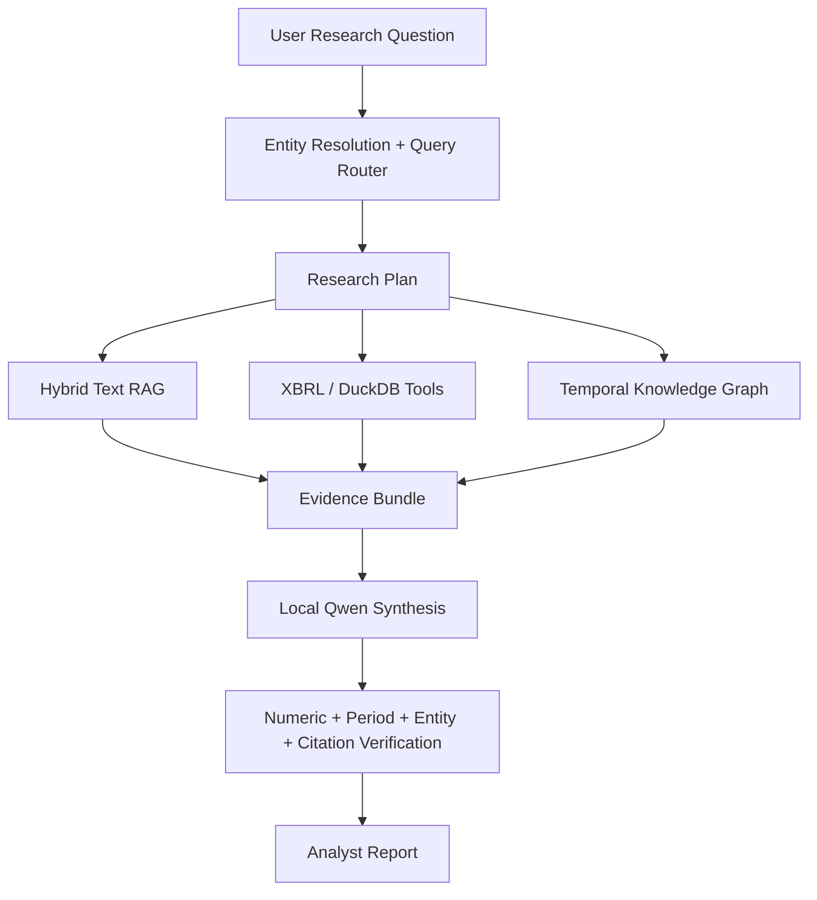

# Architecture

```mermaid
flowchart TD
  Q[User Research Question] --> R[Entity Resolution + Query Router]
  R --> P[Research Plan]
  P --> T[Hybrid Text RAG]
  P --> X[XBRL / DuckDB Tools]
  P --> G[Temporal Knowledge Graph]
  T --> E[Evidence Bundle]
  X --> E
  G --> E
  E --> L[Local Qwen Synthesis]
  L --> V[Numeric + Period + Entity + Citation Verification]
  V --> O[Analyst Report]
```

Exact arithmetic is deterministic; graph retrieval is reserved for relational questions and bounded to two hops / 30 nodes by default.
